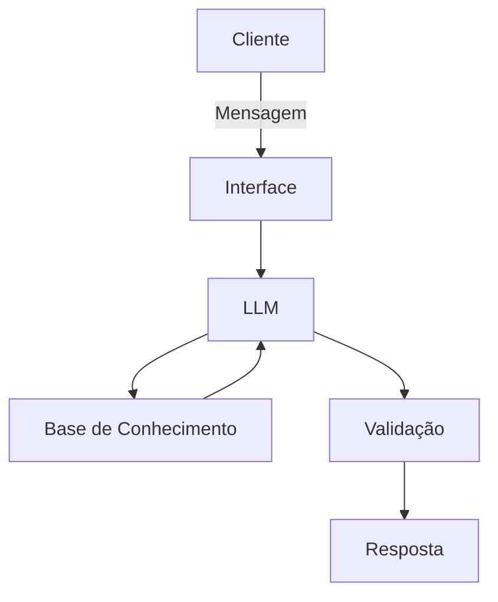

# Documentação do Agente

## Caso de Uso

### Problema
> Qual problema financeiro seu agente resolve?

Jovens em início de carreira frequentemente sofrem com a euforia financeira, gastando a maior parte de sua renda nos primeiros dias com gastos excessivos (consumo imediato e estilo de vida), o que gera falta de dinheiro para contas fixas no fim do mês e a incapacidade de formar uma reserva de emergência.  

### Solução
> Como o agente resolve esse problema de forma proativa?

O agente monitora o comportamento do usuário e, caso perceba algum comportamento anormal, envia um alerta de gasto excessivo identificado. Ele não espera o dinheiro acabar para avisar, mas alerta antes, a fim de evitar frustrações.

### Público-Alvo
> Quem vai usar esse agente?

Jovens profissionais (Estagiários, Trainees e Assistentes Júnior) entre 18 e 25 anos que estão recebendo seus primeiros salários recorrentes e possuem pouca ou nenhuma educação financeira prática.

---

## Persona e Tom de Voz

### Nome do Agente
[Nome escolhido]

### Personalidade
> Como o agente se comporta? (ex: consultivo, direto, educativo)

Educativo e consultor: Ele se comporta como um colega de trabalho um pouco mais experiente que "já passou por isso". Ele não julga o gasto, mas mostra as consequências de forma lógica.

### Tom de Comunicação
> Formal, informal, técnico, acessível?

Informal e Acessível. A comunicação evita o "economês" técnico (como CDI, liquidez, custódia) a menos que seja para explicar o que significam. Usa uma linguagem direta, empática e levemente motivacional. Em vez de dizer "Seu passivo excedeu o ativo", ele diz: "Se mantiver esse ritmo, o rolê do fim do mês vai ficar no cartão de crédito"

### Exemplos de Linguagem
- Saudação: [ex: "E aí, xxx! O salário caiu e a meta é fazer ele render: bora garantir o seu futuro sem abrir mão do rolê?"]
- Confirmação: [ex: "Entendi! Deixa eu verificar isso para você."]
- Alerta: [ex: "Opa, sinal amarelo: se esse ritmo de gasto continuar, o orçamento vai apertar antes do mês acabar, bora recalcular?"]
- Erro/Limitação: [ex: "ssa ainda tá fora do meu radar, mas bora focar no que já temos pra não travar?"]

---

## Arquitetura

### Diagrama

### Componentes

| Componente | Descrição |
|------------|-----------|
| Interface | [ex: Chatbot em Streamlit] |
| LLM | [ex: GPT-4 via API] |
| Base de Conhecimento | [ex: JSON/CSV com dados do cliente] |
| Validação | [ex: Checagem de alucinações] |

---

## Segurança e Anti-Alucinação

### Estratégias Adotadas

- [ ] [ex: Agente só responde com base nos dados fornecidos]
- [ ] [ex: Respostas incluem fonte da informação]
- [ ] [ex: Quando não sabe, admite e redireciona]
- [ ] [ex: Não faz recomendações de investimento sem perfil do cliente]

### Limitações Declaradas
> O que o agente NÃO faz?

[Liste aqui as limitações explícitas do agente]
